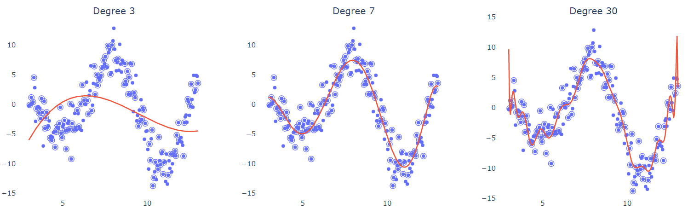

## What is bias and variance

Variance refers to the error introduced by the model’s sensitivity to small fluctuations in the dataset i.e. how “over-specialized” is your classifier to a particular training set (overfitting).

Bias is when the classifier is biased towards a particular kind of solution i.e. high bias can cause the model to miss the relevant relations between features and target outputs (underfitting).

In other words, high bias models are over-simplistic (linear models) while high variance models are complex and try to fit to the noise in the training data (high-degree polynomial models).

In the above diagram, degree 3 polynomial barealy explains the distribution of data thus showing high bias. On the other hand, degree 30 polynomial is over fitted to the noise in the dataset thus becoming sensitive to smallest fluctuations in the testing data.

So how do we select a model with low bias and low variance?

## Bias-variance tradeoff in financial forecasting

Let’s take the example of financial forecasting models to see the either extremes of high bias and high variance. We’ll also look at some techniques to balance out this see saw.

### High bias pitfalls

Oversimplified models like linear regression can provide conservative market predictions - 

- Fail to capture nonlinear relationships (e.g., geopolitical impacts on oil prices)
- Systematically underestimate volatility during market shocks
- Miss profitable opportunities by ignoring emerging trends

### High variance risks

Complex models like deep learning neural networks may - 

- Overfit to noise in historical data (e.g., 2008 crisis patterns)
- Generate unstable predictions sensitive to minor data fluctuations
- Fail during structural breaks (pandemic market behavior)

## How can we lower bias and variance in these cases?

The following two strategies amongst several can help optimize this tradeoff - 

1. **Ensemble methods** - Reduces bias through model diversity while lowering variance via aggregated predictions
2. **Regularization (L1/L2)** - Adding a regularization penalty significantly decreases variance but may slightly increase bias.

## References

1. https://www.kdnuggets.com/2021/08/visualizing-bias-variance.html