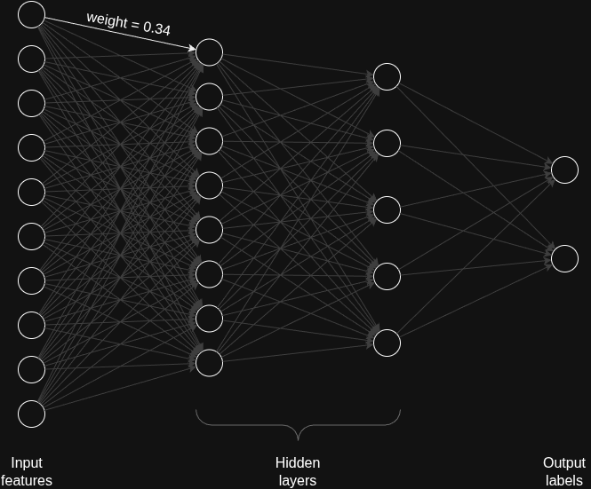

---
As I embark upon this journey of understanding large language models, I wondered what do the “models” comprise of and how does it affect the model size on disk. 

In this article - 

1. Math behind the weight/size of a simple neural network 
2. How does quantization affect the loaded weights?

## Figuring model sizes

I started by loading Microsoft’s PHI-2 model in RAM using the `transformers` library - 

```python
model = AutoModelForCausalLM.from_pretrained("microsoft/phi-2")
str(round(model.get_memory_footprint()/(1024*1024*1024), 2)) + " GB"

## Output: '10.36 GB'
```

My first question - What exactly is comprised in this ~10.3 GB. Obviously the weights in the model but how does the math compute?

The huggingface card for the phi-2 model says 2.7 billion parameters. Before we go on to calculate the size of the phi-2 model, let us take a step back and work with a simple neural network.

### Size of a Stupid Simple Neural Network

I decided to calculate the number of parameters in a simple feed forward neural network with two hidden layers each with 8 and 5 neurons each. Let’s say the input layer has 10 neurons and output labels were 2.



In this case the total number of parameters are - 

1. 10\*8 + 8\*5 + 5*2 (weights across the neurons in each layer since fully connected)
2. 8 + 5 + 2 (bias; only for hidden and output layers)

Totalling to 145 weights! (or as we call them parameters). 

These are the weights which get updated in each pass of the training data. And these weights comprise of the brains of the model. 

All these weights are stored as fp32. That means 4 bytes per weight. That brings our model to 145*4 = 580 bytes or 0.5 kb. 

### Size of Phi-2 Model

```python
for param in model.parameters():
    print(param.dtype)
    
## Output: 
## torch.float32
## torch.float32
## torch.float32
## ... and so on
```

Now phi-2 has 2.7 billion parameters stored as fp32 dtype, that means the total memory footprint of the model would be 2.7 billion  * 4 bytes = **10.8 GB**

The model first gets loaded into RAM. It only gets loaded to the GPU when we explicitly tell it to via the `model.to("cuda:0")` function.

## An exception with quantized model

On the contrary when you load a quantized model, majority of the model parameters get loaded into GPU VRAM and part of it gets loaded into RAM. 

Quantization is a model compression technique that reduces a LLM’s size and speeds up inference by converting its high-precision numerical weights (like 32-bit floats) to lower-precision formats (like 8-bit or 4-bit integers). In our case, it resulted in an almost ~3.5x reduction in size down to 2.8 GB!

```python
quantization_config = BitsAndBytesConfig(
    load_in_8bit=True,  # Load model in 8-bit for memory efficiency
    llm_int8_enable_fp32_cpu_offload=True
)

model_quantized = AutoModelForCausalLM.from_pretrained("microsoft/phi-2",quantization_config=quantization_config)

str(round(.get_memory_footprint()/1073741824, 2)) + " GB"

## Output: '2.83 GB'
```

There are various quantization methods like AWQ (Activation-Aware Weight Quantization), GPTQ (Generalized Post-training Quantization), and BNB (Bits and Bytes). We will be using Bits and Bytes implementation in the transformers library here. (I’ll have a separate article going into the different quantization methods).

```python
for param in model_quantized.parameters():
    print(param.dtype)
## Output:
## torch.float16
## torch.int8
## torch.float16
## torch.int8
## ... and so on
```

After quantization to 8 bits, some of the fp32 weights are converted to int8 weights and some are converted to fp16 weights. The fp16 weigthts are loaded onto CPU while int8 are loaded onto GPU. And the reason is because of the specialized hardware and their capabilities.

| CPU Hardware | GPU Hardware |
| --- | --- |
| 32-bit and 64-bit calculations | Low-precision arithmetic calculations |
| Sequential calculations | Parallel computations |
| Same-bit arithmetic | Mixed-precision calculations |
| - | Increased number of Arithmetic Logic Units (ALUs) |

---

You can find the Jupyter notebook for the model size exploration on my Github - [model_size_exploration.ipynb](https://github.com/nirajpandkar/transformers-from-scratch/blob/master/notebooks/model_size_exploration.ipynb).

If you have any more questions regarding this article, feel free to [reach out to me on X](https://x.com/Niraj_pandkar). And don't forget to check out the newsletter - https://nirajpandkar.substack.com!