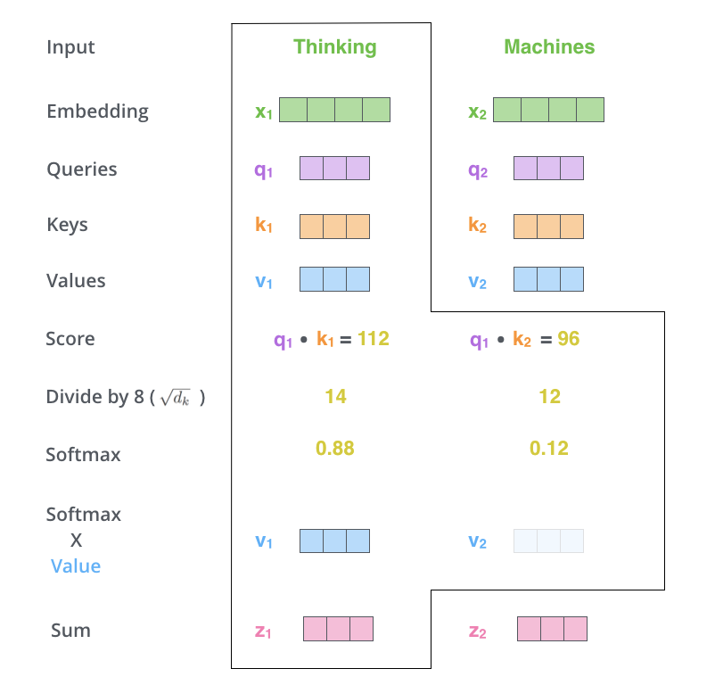
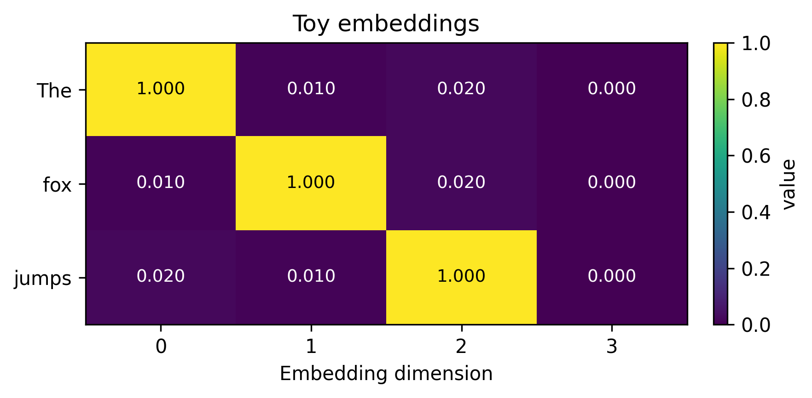
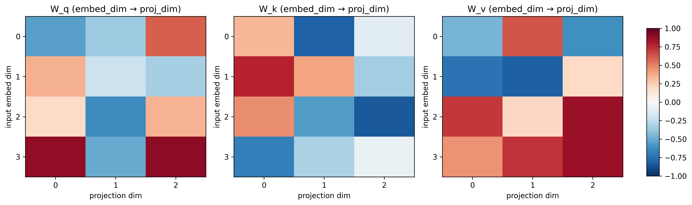
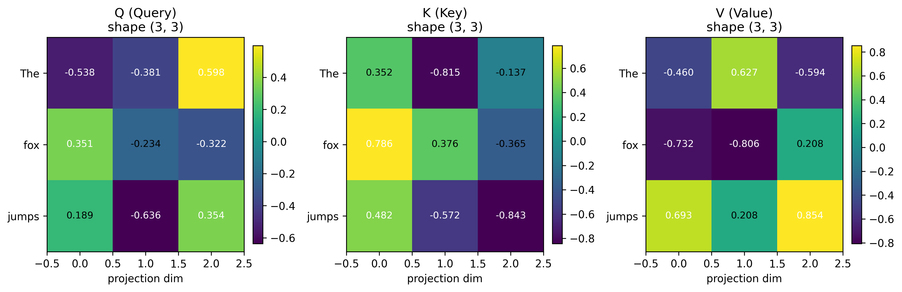
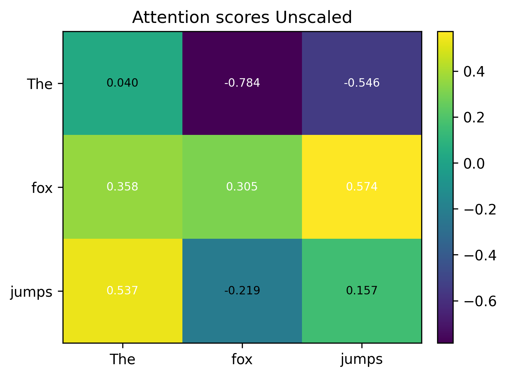
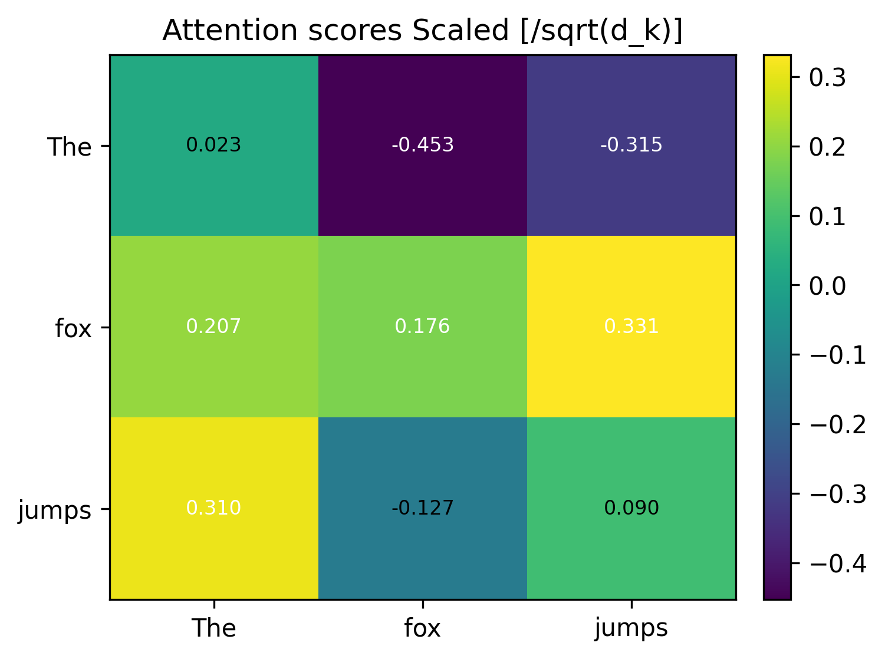
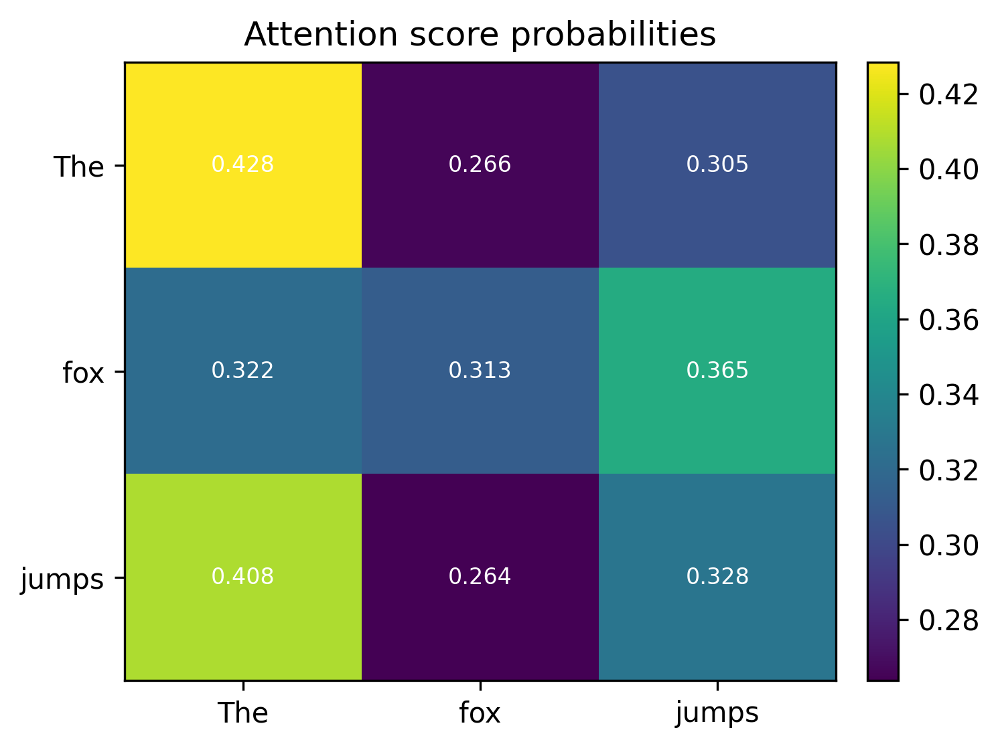
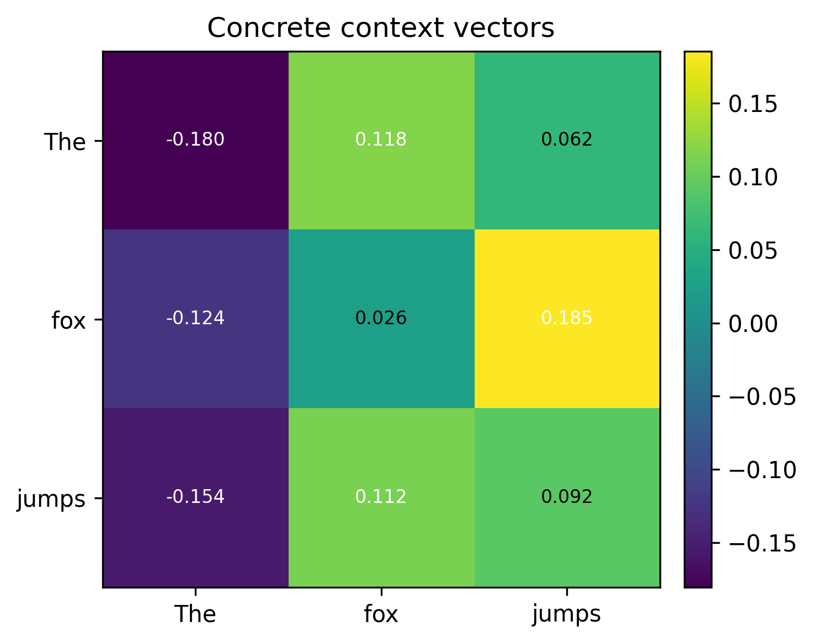

Come with me on a visual understanding of the self-attention calculations that are at the heart of transformers. This article is pretty niche and expands only on the attention formula - 

> Attention(Q,K,V) = softmax(Q K^T / sqrt(d_k)) V

We will deconstruct every letter in the above formula till you understand the semantic meaning of what’s going on behind the scene. My primary goal is to provide an intuition on how the self-attention mechanism helps relate words in a sentence with a follow-along example sentence -  

> The fox jumps.

Prerequities - 

1. Dot product significance
2. Matrix multiplication
3. Understanding of word embeddings; one-hot encoding

## Motivation

When I embarked on this journey, the calculations seemed pretty simple but abstract. I wanted to understand what’s going on underneath. 

Some assumptions - 

- **The calculation will consider only one sentence.** Though the powerhouse of transformers is matrix multiplication. It is capable of catering to hundreds of sentences in parallel.
- **We will consider only one “head”** (More on this later; it’s okay if you don’t understand it right now). Matrix multiplication, being the superpower it is, can cater to calculations for multiple heads at once as well.
- **We will consider the most primitive form of word embeddings - one-hot encoding.**

Let’s get on with it 😄

## The Formula

> Attention(Q,K,V) = softmax(Q K^T / sqrt(d_k)) V

If you have tried to read about transformers/attention anywhere on the web, you must have seen the following famous info graphic. This definitely helps you in the initial 40% and then at least I got stuck. 

I wanted more behind the scenes with actual matrix results shown with a toy example.

Your wait is over!

")
<figure>
  
  <figcaption>Infographic from [Jay Almar's article](https://jalammar.github.io/illustrated-transformer/)</figcaption>
</figure>

Let’s consider the following sentence with one-hot encodings for each word. 

> The fox jumps.

Pretty simple. As you might have observed, I have added a slight offset to make the calculations non-orthogonal. 

But we need Q, K and V matrices. How do we get them from these input embeddings?

## Intuition behind Q, K and V matrices

As the word attention elicits, we focus on each word of the sentence one by one and ask ourselves - “how does this word relate to every other word in the sentence?”

For example, if we focus on “fox”, we can formulate the following questions - 

> What does the fox do?

Obviously your attention goes to the key "jump" and hence it should have a higher attention score. And I’m saying higher because of the question being asked here. If my query changed to the following, your answer would change - 

> What is the article used for fox?

Now we should get a higher attention score for the key "the".

### Who controls the query?

Nobody.

It’s learned. It’s implicit. It is something we let the model learn itself. Just like how in an ImageNet model, you don’t explicitly specify the features it should consider to identify whether the given image is cat or dog, you don’t tell the model what query to ask.

And the model “learns” to ask these queries by multiple iterations of training loops. The trainable parameters look like the following - 

And when you matrix multiply the input embeddings (dimension: 3x4) with each of these trained matrices (dimension: 4x3), you get Q, K and V matrices! -

### Who decides the dimensions of these trainable parameters?

Us! It’s a hyper parameter which we choose before training.

Usually, the word embeddings for a word are represented by a vector of 512 floating-point numbers. That puts a lot of burden on the GPU. That’s why we choose to represent each word in a lower dimensionality. In the Transformer paper, they have chosen this to be 64. 

We can say that the input embeddings are linearly projected into a lower dimensionality. In this case, every word is now represented by three numbers instead of 4.

### So how many queries does the model ask?

That’s where the concept of “heads” come into being. Each “head” asks a different question. Now when you hear “multi-headed” attention (MHA), that’s what it means! 

This is a hyper parameter of the model that the user controls. We can control how many heads/queries the model asks!

In this article, we are essentially asking only one question. Again, we don’t control what question is being asked, but how many questions should be asked in order for the model to have a better semantic understanding of the whole sentence.

## How are relations between the words calculated then?

Dot product!

A dot product measures how aligned a "query" vector is to a "key" vector. In other words, it calculates the similarity score between two words.

Larger dot product -> Higher compatibility -> Higher attention

### Unscaled attention score

> Attention(Q,K,V) = softmax(**Q K^T** / sqrt(d_k)) V

Here we are multiplying the query and key vectors by taking a transpose of the key vector to match dimensions.

The following are raw unscaled similarity scores amongst the words. 

### Scaled attention scores

> Attention(Q,K,V) = softmax(**Q K^T / sqrt(d_k)**) V

The numbers in this toy example are very small. But in reality, these multiplications and additions can compound quickly and result in larger magnitude of numbers. This makes the softmax outputs extremely peaky (one position gets almost all weight) and yields tiny gradients. Dividing by sqrt(d_k) keeps the logits in a stable numeric range so softmax behaves well.

That’s why we scale them down by dividing by the square root of the projection dimension. Vaswani et al. chose it because it was simple and kept the variance of the dot product roughly constant. 

### Attention score probabilities

> Attention(Q,K,V) = **softmax(Q K^T / sqrt(d_k))** V

But these are raw attention scores and they don't give us a relative score of how each word belongs to the word “fox”, for example.

Softmax turns the raw dot‑product logits into a probability distribution over keys: non‑negative weights that sum to 1.

The scores above are “by how much” the keys (X axis) affect the query words (y axis).
### Context vectors

> Attention(Q,K,V) = **softmax(Q K^T / sqrt(d_k)) V**

V contains the actual content to be read. Multiplying the weights by V turns those weights into concrete context vectors via a weighted sum.

We started with arbitrary one hot encodings but very coincidentally, you can see that fox and jumps do have a correlation. 

## Conclusion

This article should have given you a peek inside the scaled dot product calculations for attention. 

The concrete context vectors are further multiplied by another trainable parameter (W_o) to bring it back into their original dimension of 3x4. But this is outside the scope of this article.

In the next post, I will talk about the next few blocks that these context vectors go through - **feed forward neural network and positional encoding.**

---

If you have any more questions regarding this article, feel free to [reach out to me on X](https://x.com/Niraj_pandkar). And don't forget to check out the newsletter - https://nirajpandkar.substack.com!
