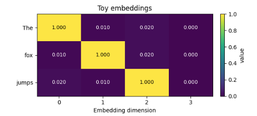
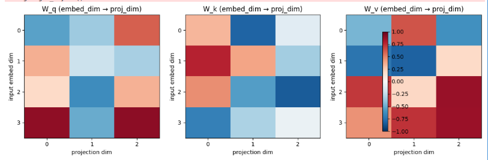
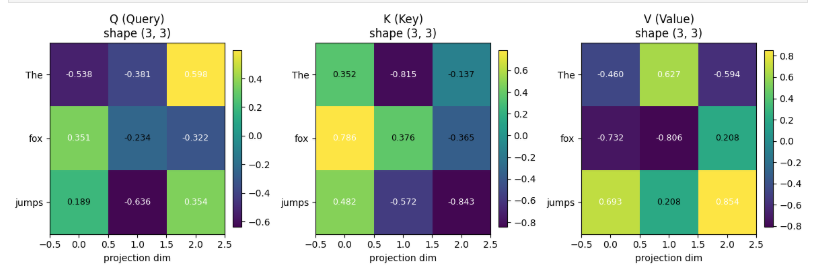
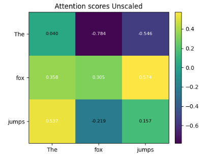
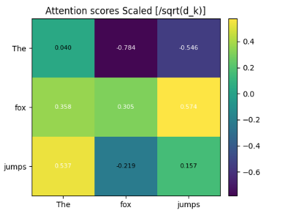
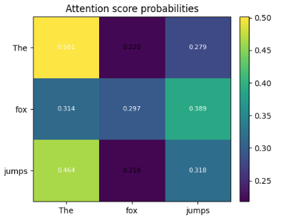
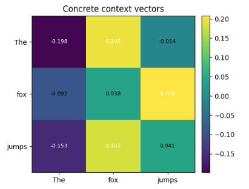

# Self attention with toy example

Come with me on a visual understanding of the self-attention calculations that are at the heart of transformers. This article is pretty niche and expands on the attention mechanism - 

> Attention(Q,K,V) = softmax(Q K^T / sqrt(d_k)) V
> 

We will deconstruct every letter in the above formula till you understand the semantic meaning of what’s going on behind the scene. My primary goal is to provide an intuition on how the self-attention mechanism helps relate two words in a sentence with a follow-along example sentence -  

> The fox jumps.
> 

Prerequities - 

1. Dot product significance
2. Matrix multiplication
3. Understanding of word embeddings; one-hot encoding

When I embarked on this journey, the calculations seemed pretty simple but abstract. I wanted to understand what’s going on underneath. Some assumptions and the reasons for the assumptions - 

1. The calculation will consider only one sentence (Literally 1 batch with batch size = 1)
    1. The powerhouse of transformers is matrix multiplication.
    2. It is capable of catering to hundreds of sentences in parallel.
2. We will consider only one “head”. (More on this later; it’s okay if you don’t understand it right now)
    1. Matrix multiplication, being the superpower it is, can cater to calculations for multiple heads at once. 
3. We will consider the most primitive form of word embeddings - one-hot encoding.

Let’s get on with it 😄

# The Formula

> Attention(Q,K,V) = softmax(Q K^T / sqrt(d_k)) V
> 

If you have tried to read about transformers/attention anywhere on the web, you must have seen this famous info graphic. This definitely helps you in the initial 40% and then at least I got stuck. I wanted more behind the scenes with actual matrix results shown with a toy example. Your wait is over 😄

Let’s consider the following sentence with one-hot encodings for each word. 

Pretty simple. But we need Q, K and V matrices. How do we get them from these input embeddings? And what the hell are they?

# Q, K and V

> The **fox** jumps
> 

*Query*: What does the fox do?

*Key*: All the words in the sentences

*Value:* The representation of each word (one hot encoding from above)

As the word attention elicits, we focus on each word of the sentence one by one and ask ourselves - “how does this word relate to every other word in the sentence?”

For example, if we focus on “fox”, two questions come to mind - 

1. Does the fox “the”?
2. Does the fox “jumps”?

Obviously the query #1 should garner lower attention score than #2. And I’m saying lower (and not zero) because of the question being asked here. If my query changed to the following, your answer would change - 

1. Is “the” the article to fox?
2. Is “jumps” the article to fox?

Now obviously, #1 should garner a higher attention score than #2!

### Who controls the “query”?

Nobody.

It’s learned. It’s implicit. It is something we let the model learn itself. Just like how in an Imagenet model, you don’t explicitly specify the features it should consider to identify whether the given image is cat or dog, you don’t tell the model what query to ask.

And the model “learns” to ask these queries by multiple iterations of training loops. The trainable parameters look like the following - 

And when you send the input embeddings through each of these trained matrices, you get Q, K and V matrices! -

### Who decides the dimensions of these trainable parameters?

Us! It’s a hyper parameter which we choose before training.

Usually, the word embeddings for a word are represented by a vector of 512 floating-point numbers. That puts a lot of burden on the GPU. That’s why we choose to represent each word in a lower dimensionality. In the Transformer paper, they have chosen this to be 64. 

We can say that the input embeddings are linearly projected into a lower dimensionality. In this case, every word is now represented by three numbers instead of 4.

### So how many queries does the model ask? Isn’t it infinite?

That’s where the concept of “heads” come into being. Each “head” asks a different question. Now when you hear “multi-headed” attention (MHA), that’s what it means! 

This is a hyper parameter of the model that the user controls. We can control how many heads/queries the model asks!

This article will ask only one quesiton. Again, we don’t control what question is being asked, but how many questions should be asked in order for the model to have a better semantic understanding of the whole sentence.

## How are relations between the words calculated then?

Dot product!

Similarity between word embeddings have been calculated using dot products since the beginning of time. Cosine simialrity is another method.

And the most efficient way to calculate dot product is via matrix multplication.

### Unscaled attention score

> Attention(Q,K,V) = softmax(**Q K^T** / sqrt(d_k)) V

The numbers in this toy example are very small. But in reality, these mutiplications can compound quickly and cause Floating Point Overflows.

### Scaled attention scores

> Attention(Q,K,V) = softmax(**Q K^T / sqrt(d_k)**) V

That’s why we scale them down by dividing by the square root of our projection dimension (3). It’s chosen by the author of the paper and worked in their favor. We can perhaps choose our own.

But these are raw attention scores and doesn’t give us a relative score of how each word belongs to the word “fox”, for example.

### Attention score probabilities

> Attention(Q,K,V) = **softmax(Q K^T / sqrt(d_k))** V

That’s why we put them through the softmax funciton - 

The scores above are “by how much” the keys (X axis) affect the query words (y axis). Which is why the next step is to multiply the scores with “values”.

### Context vectors

> Attention(Q,K,V) = **softmax(Q K^T / sqrt(d_k)) V**

We started with arbitrary one hot encondings but very coincidentally, you can see that fox and jumps do have a correlation 😉. 

And now we just sum up all these scores up together for each word which becomes our final attention score for each word.